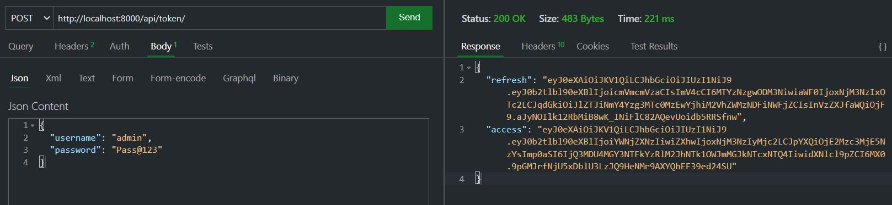
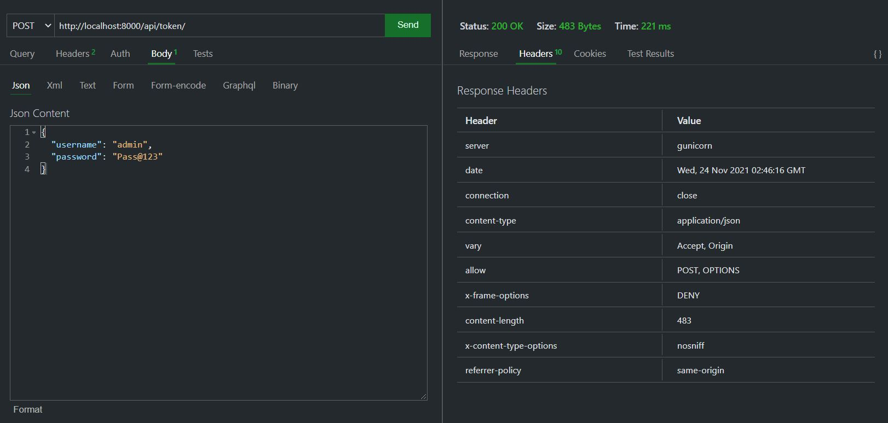
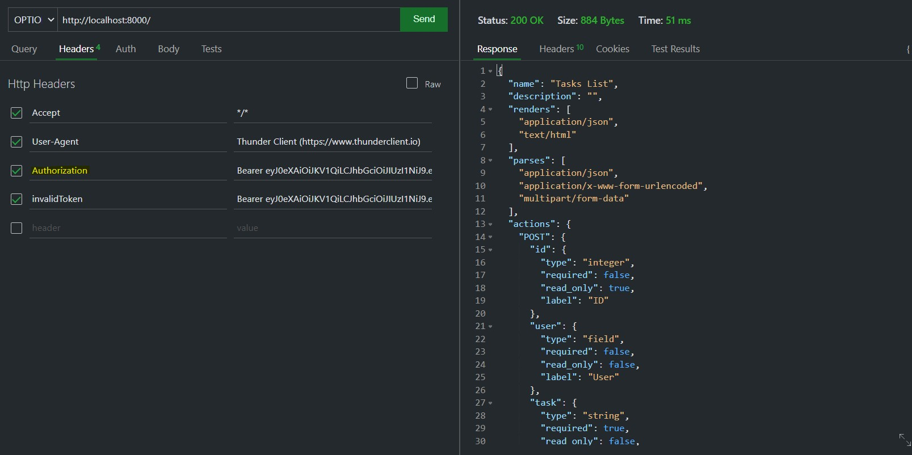

# drf-auth
Lab: Authentication &amp; Production Server

# [Pull Request](https://github.com/odehabuzaid/drf-auth/pull/1)

## [Deployed Version](https://drf-api-auth.herokuapp.com/)
- admin :  Pass@123
- user  :  Pass@123

### JWT 

#### token request for Authintic User

#### Valid token response

